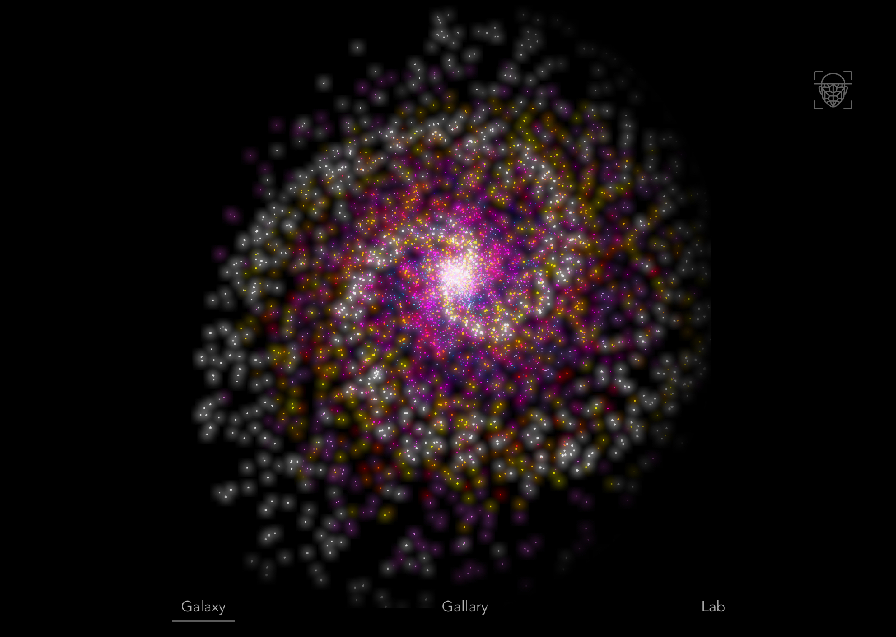
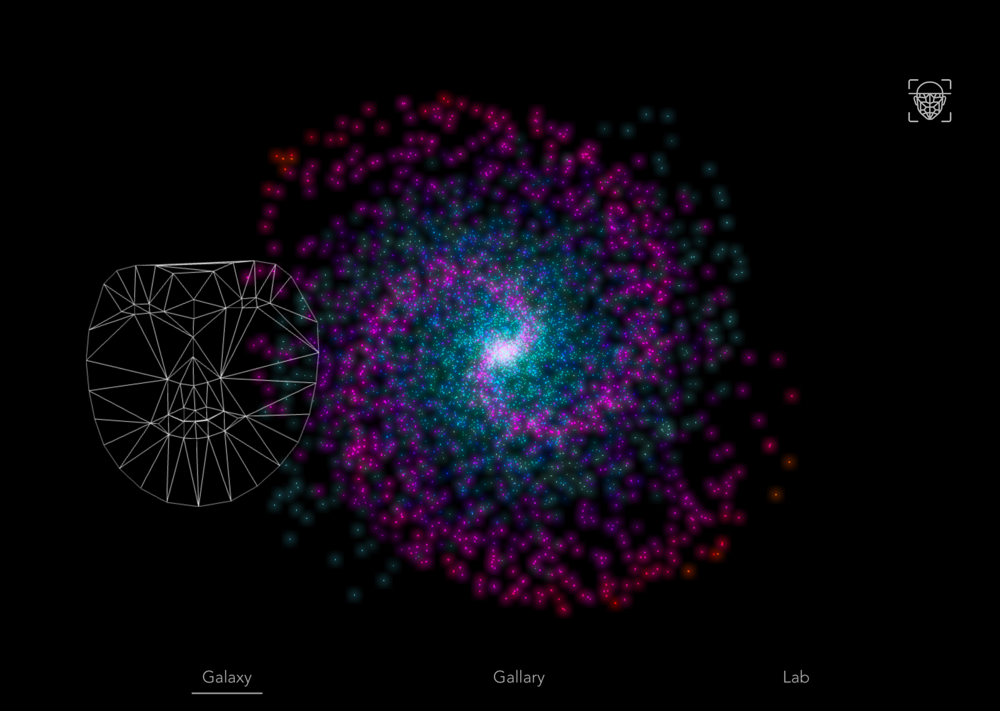
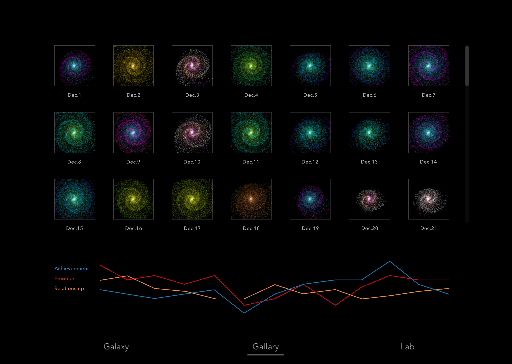
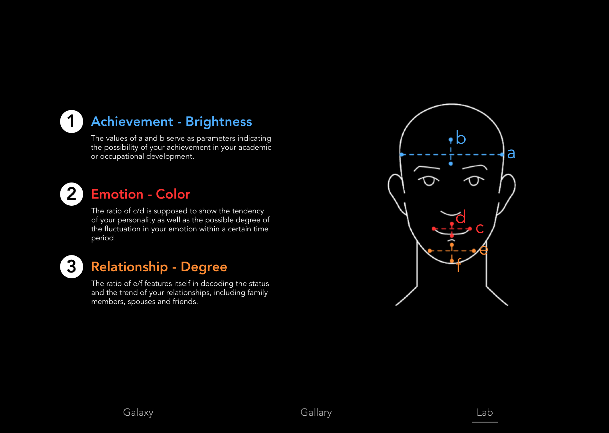

# GalaxyTells
######
## *Overview*
### GalaxyTells is a data-driven physiognomy system
Using facial recognition and AI-based pattern analysis, it decodes facial features and provides fascinating insights into individualized prediction, including emotion & personality, relationship, and achievement.
## *User Flow*
After entering the system, users will see a generated galaxy. This galaxy is generated based on their face data, including e.g. the width and vertical length of their forehead, the ratio of the width of the mouth and the vertical length of the mouth, the ratio of the width of the jaw and the vertical length of it, and etc.

(Figure 1: the user interface of the system consisting of 3 main sections: galaxy, gallery and lab.)

(Figure 2: a galaxy is generated based on the face data)

(Figure 3: Here is the record of personal galaxy data)
- When a user goes out in the morning, she or she will get a fortune prediction. Also, the user will give feedback to correct to the system at night before going to bed.
- In the long-term tracking progress, the user's fortune will present a certain pattern. With continuous feedback, the prediction model will be more and more accurate and credible.
- After constructing the basic model, for each prediction, the system will find the record with the closest facial feature in the database, target its position in the pattern, and retrieve the fortune record of that stage for prediction.

(Figure 4: users can also click into “Lab” to see the generating mechanism of the system)

----

The galaxy is controlled by several parameters:

- Color Range
- Galaxy Size- Star Size
 - Stars Density 
 - Brightness Distribution
 - Rotational Curve

--------

- Emotion - Color Range
- Achievement -Stars Density, Brightness Distribution
- Relationship - Galaxy Size, Rotational Curve

